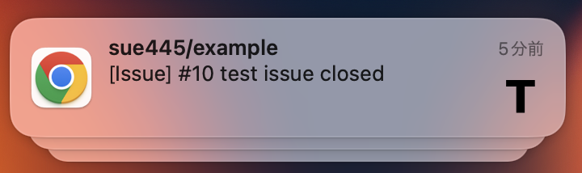

> [!IMPORTANT]
> This extension is scheduled for maintenance end after **July 2024**. (If nothing else)
>
> See https://github.com/sue445/chrome-tanuki-notifier/issues/816

# Tanuki Notifier for Google Chrome™

"Tanuki Notifier for Google Chrome™" notify GitLab™ Project events (Commit, Issue, MergeRequest and Milestone)

_GITLAB is a trademark of GitLab Inc. in the United States and other countries and regions_

## Requirements
### API v3
* GitLab v5.3.0+ and v6.0.x and v6.2.0+
  * **only 6.1.0** is not supported
  * v7.9.0+ is recommended

### API v4
* GitLab v9.5.0+

## Usage
1. Install this extension
2. Open extension option
3. Input these
    * GitLab Path
    * GitLab API Path
    * Private token
        * GitLab -> Edit Profile -> Account
4. Refresh Repository List
5. Check events
6. Save
7. Wait a minute

## Upgrading
Open extension option -> Clear cache

## Screenshots
### Option

### Notification

### Popup

## Dependency GitLab API
* `GET /projects`
  * https://github.com/gitlabhq/gitlabhq/blob/master/doc/api/projects.md#list-projects
* `GET /projects/:id/events`
  * https://github.com/gitlabhq/gitlabhq/blob/master/doc/api/projects.md#get-project-events
* `GET /projects/:id/issues/:issue_id`
  * https://github.com/gitlabhq/gitlabhq/blob/master/doc/api/issues.md#single-issue
* `GET /projects/:id/merge_request/:merge_request_id`
  * https://github.com/gitlabhq/gitlabhq/blob/master/doc/api/merge_requests.md#get-single-mr
* `GET /projects/:id/milestones/:milestone_id`
  * https://github.com/gitlabhq/gitlabhq/blob/master/doc/api/milestones.md#get-single-milestone
* `GET /users/:id`
  * https://github.com/gitlabhq/gitlabhq/blob/master/doc/api/users.md#single-user

## FAQ
### Hot to use on [GitLab.com](https://gitlab.com/) ?
Input these to option

* GitLab Path : `https://gitlab.com/`
* GitLab API Path : `https://gitlab.com/api/v4/`
