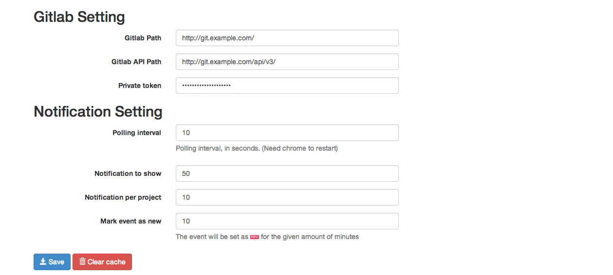
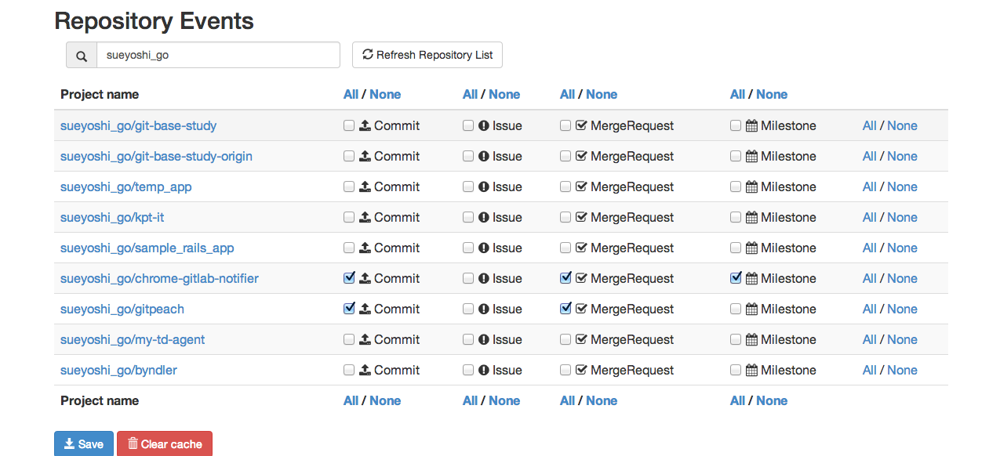
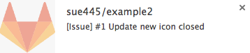
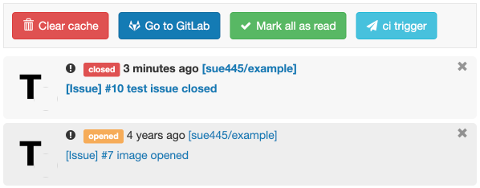

# GitLab Notifier for Google Chrome™   

Notify GitLab Project events (Commit, Issue, MergeRequest and Milestone)

## Require
* GitLab API 5.3.0+ and 6.0.x and 6.2.0+
  * **only 6.1.0** is not supported
  * v7.9.0+ is recommended

## Usage
1. Install this extension
2. Open extension option
3. Input these
  * GitLab Path
  * GitLab API Path
  * Private token
     * GitLab -> Edit Profile -> Account
4. Refresh Repository List
5. Check events
6. Save
7. Wait a minute

## Upgrading
Open extension option -> Clear cache

## Screenshots
### Option

### Notification

### Popup

## Dependency GitLab API
* `GET /projects`
  * https://github.com/gitlabhq/gitlabhq/blob/master/doc/api/projects.md#list-projects
* `GET /projects/:id/events`
  * https://github.com/gitlabhq/gitlabhq/blob/master/doc/api/projects.md#get-project-events
* `GET /projects/:id/issues/:issue_id`
  * https://github.com/gitlabhq/gitlabhq/blob/master/doc/api/issues.md#single-issue
* `GET /projects/:id/merge_request/:merge_request_id`
  * https://github.com/gitlabhq/gitlabhq/blob/master/doc/api/merge_requests.md#get-single-mr
* `GET /projects/:id/milestones/:milestone_id`
  * https://github.com/gitlabhq/gitlabhq/blob/master/doc/api/milestones.md#get-single-milestone

## Test Suite
http://sue445.github.io/chrome-gitlab-notifier/spec/SpecRunner.html

